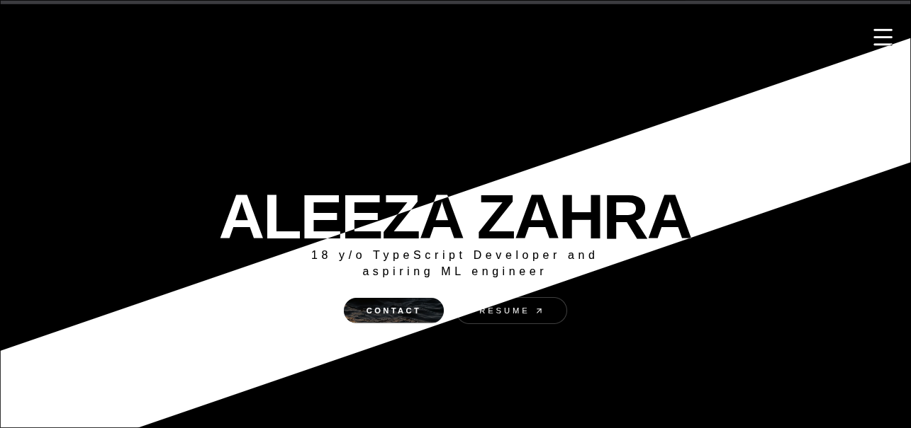
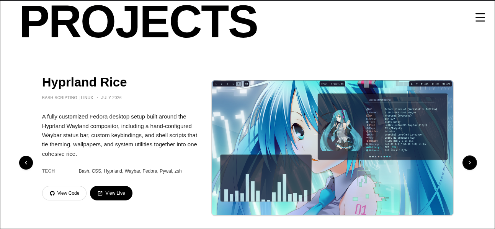
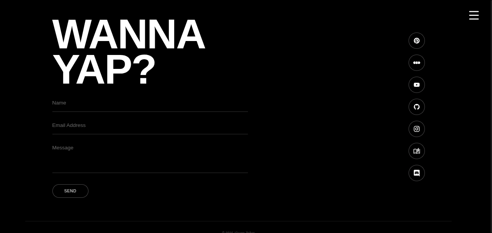

## Portfolio Site
Hi, this is my (third) portfolio um apparently I just didn't like the design of the previous two, so here we are.

A single-page personal site built to showcase my projects, tech stack, and a way to get in touch.

## Features

- It has premium black and white theme ig 
- Smooth and easy navigation between sections
- Scroll triggered animations throughout (Gsap + Framermotion)
- Working contact form via EmailJS
- Fully responsive , deployed on vercel


## Tech Stack

- **React 19 + TypeScript** — component structure
- **Gsap** - used gsap to create the scroll triggering in flowart component
- **Tailwind CSS** — styling
- **Framer Motion** — scroll effects in text
- **Iconify (`@iconify/react`)** — icons for tech stack and socials
- **EmailJS** — handles the contact form so people can reach out without me needing a backend 
- **Vercel** — deployment

## AI Usage
Used AI (codex) for debugging in flowart component and some fixes in hamburger 

## Sections

| Section | File | Notes |
|---|---|---|
| Projects | `Projects.tsx` | Carousel of featured work with prev/next navigation and a scramble-text hover heading |
| Tech Stack | `TechStack.tsx` | Grouped list of frontend/backend/platform/tool skills that I work with, scroll fade-in per group |
| Statement | `Statement.tsx` | Full-bleed mission statement, scramble-text reveal triggered once on scroll into view |
| Contact | `About.tsx` | Contact form (EmailJS) plus social links |

Section wrapping/pinning is handled by a shared `FlowSection` component (`Flowart.tsx`).

### Heading effect

Several headings ("Projects", "Tech Stack", "Wanna yap?") use a shared scramble/decode text effect: on hover, letters cycle through random characters and resolve left to right into the real word. The Statement heading uses the same effect but fires once automatically when it scrolls into view instead of on hover.


## Getting Started

```bash
git clone https://github.com/aleezazahra/my-portfolio
cd my-portfolio
npm install
npm run dev
```

### Build

```bash
npm run build
```

## Deployment

Deployed on [Vercel](https://vercel.com/), connected to this repo for automatic deploys on push.

## Some Screenshots (cool to add for reviewers ig)





## License

All content and code are © 2026 Aleeza Zahra. Not licensed for reuse.